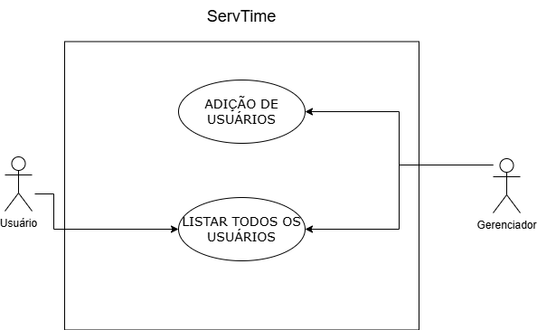

# ServTime

This repository stores the files for the ServTime project, which will be used by customers to schedule services offered by service providers. The application is responsible for displaying and managing a service provider's agenda and allowing customers to find and schedule services offered.

This project is still under development.

## Installation
To use ServTime, follow these steps:

1. Clone the repository: `git clone https://github.com/hugo451/ServTime.git`
2. Install the required dependencies with: `npm install`
3. Start the application: `npm run dev`

## Usage

Once the application is running, you can access it through your web browser at `http://localhost:3000`. For now, it's only possible to interact directly with the endpoints.

### User management

<!-- imagem com o diagrama de casos de uso - a traduzir -->



- **Add user [only for managers]**: To add new users, you need to send a POST request to the `/client` endpoint with the user's details in the request body. You can use Postman to do this:

  1. Open Postman.
  2. Create a new POST request.
  3. Set the URL to `http://localhost:3000/client`.
  4. Go to the "Headers" tab and add a new header with the key `Content-Type` and the value `application/json`.
  5. Go to the "Body" tab, select `raw` and `JSON` format, and enter the following JSON:
    ```json
      {
        "id": "550e8400-e29b-41d4-a716-446655440000",
        "username": "user",
        "password": "passWord12",
        "name": "name",
        "adress": "adress",
        "phone": "phone",
        "mail": "mail@mail.com"
      }
    ```
  6. Click "Send" to send the request.

- **Get users**: To retrieve the list of users, send a GET request to the `/client` endpoint using Postman:

  1. Open Postman.
  2. Create a new GET request.
  3. Set the URL to [`http://localhost:3000/client`]
  4. Click "Send" to send the request.

### Service management
- **Add service [only for managers]**: To add new services, you need to send a POST request to the `/service` endpoint with the service's details in the request body. You can use Postman to do this:

  1. Open Postman.
  2. Create a new POST request.
  3. Set the URL to `http://localhost:3000/service`.
  4. Go to the "Headers" tab and add a new header with the key `Content-Type` and the value `application/json`.
  5. Go to the "Body" tab, select `raw` and `JSON` format, and enter the following JSON:
    ```json
      {
        "serviceid": "550e8400-e29b-41d4-a716-446655440000",
        "name": "servicename",
        "type": "servicetype",
        "description": "servicedescripition",
        "price": 500.00
      }
    ```
  6. Click "Send" to send the request.

- **Get users**: To retrieve the list of users, send a GET request to the `/client` endpoint using Postman:

  1. Open Postman.
  2. Create a new GET request.
  3. Set the URL to [`http://localhost:3000/client`]
  4. Click "Send" to send the request.

## CLI Usage

There's a CLI to create entities or some parts of them, like controller, repositories or even commands. To use this, run the cmd command:
```
npm run create [command] [entity]
```
Those are the commands:
* `module` to create all entity and patterns
* `entity` to create the entity interface
* `dto` to create the DTO classes
* `directories` to create the directory arch
* `controller` to create the controller class
* `repository` to create all repositories and factory
* `create-exception` to create the create exception


## Contributing

Contributions are welcome! If you have any ideas or suggestions to improve ServTime, please follow these steps:

1. Fork the repository.
2. Create a new branch for your feature or bugfix: `git checkout -b my-feature-branch`
3. Make your changes and commit them: `git commit -m 'Add new feature'`
4. Push your changes to your fork: `git push origin my-feature-branch`
5. Create a pull request with a description of your changes.

